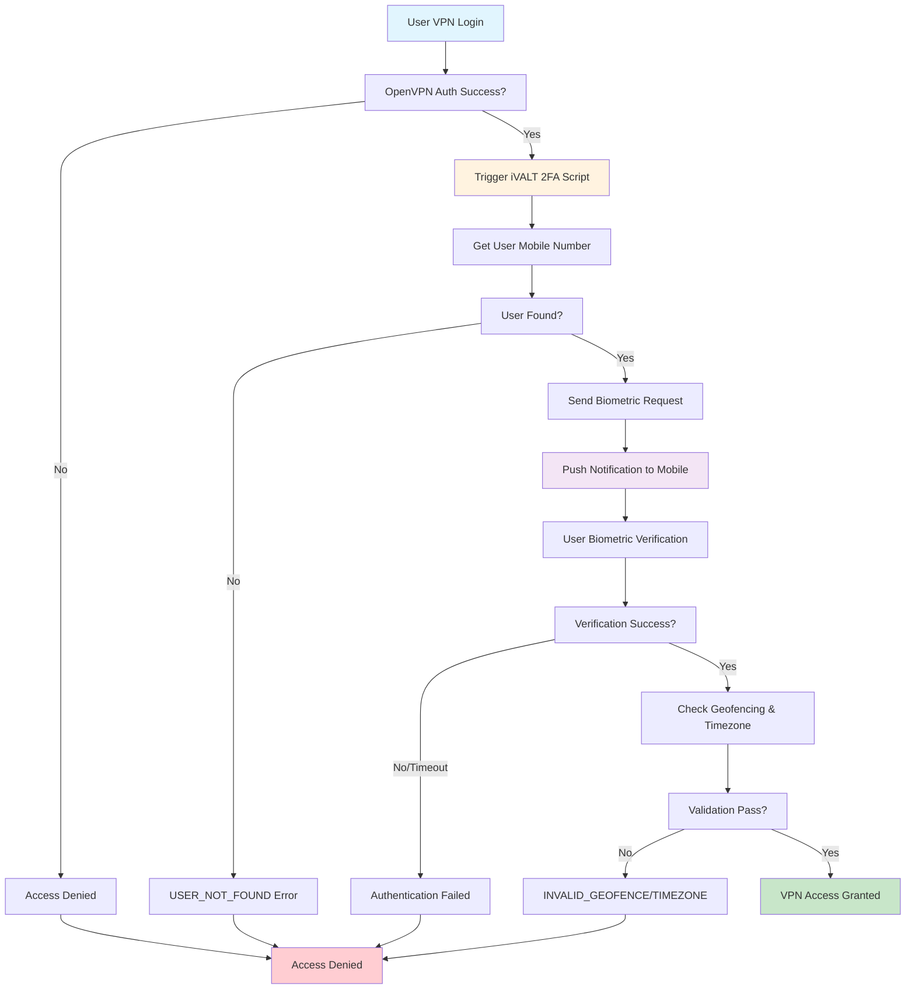

# OpenVPN Access Server iVALT 2FA Integration

[](https://opensource.org/licenses/Apache-2.0)
[](https://www.python.org/downloads/)
[](https://openvpn.net/)

A professional post-authentication script for OpenVPN Access Server that integrates with iVALT's biometric authentication system to provide seamless 2FA/MFA capabilities.

## Features

- 🔐 **Biometric Authentication**: Leverages iVALT's mobile biometric verification
- 🌍 **Geofencing Support**: Location-based authentication controls
- ⏰ **Timezone Validation**: Time-based security checks
- 🔄 **Automatic Retry Logic**: Robust error handling and retry mechanisms
- 📱 **Mobile Integration**: Seamless mobile app integration for authentication
- 🛡️ **Security First**: Enterprise-grade security with comprehensive error handling

## Overview

This script extends OpenVPN Access Server's authentication capabilities by adding a second factor through iVALT's biometric authentication system. After initial VPN authentication (LOCAL, PAM, LDAP, or RADIUS), the script:

1. Retrieves the user's mobile number from iVALT
2. Sends a biometric authentication request to the user's mobile device
3. Waits for user confirmation via biometric verification
4. Validates geofencing and timezone requirements
5. Grants or denies VPN access based on the authentication result

### Authentication Flow



## Prerequisites

- OpenVPN Access Server 2.8+ or compatible version
- Python 3.7 or higher
- iVALT API access and credentials
- Network connectivity to iVALT API endpoints

## Installation

### 1. Clone the Repository

```bash
git clone https://github.com/iVALT-Inc/openvpn-ivalt-2fa.git
cd openvpn-ivalt-2fa
```

### 2. Install Dependencies

```bash
pip install -r requirements.txt
```

Or install directly:

```bash
pip install requests>=2.28.0
```

### 3. Configure OpenVPN Access Server

1. Copy the `main.py` script to your OpenVPN Access Server
2. Configure the script as a post-authentication hook
3. Set the iVALT secret key in the script

## Configuration

### Environment Variables

Set the following environment variable or update the script directly:

```python
IVALT_SECRET_KEY = "your_ivalt_secret_key_here"
```

### OpenVPN Access Server Configuration

Please refer the link below

https://openvpn.net/as-docs/tutorials/tutorial--install-post-auth-script.html#tutorial--how-to-install-a-post-auth-script

## Usage

### Basic Setup

1. **Configure iVALT API Key**: Update the `IVALT_SECRET_KEY` variable in `main.py`
2. **Deploy Script**: Place the script on your OpenVPN Access Server
3. **Configure OpenVPN**: Set up the post-authentication hook
4. **Test Authentication**: Verify the integration works with test users

### Authentication Flow

```
User Login → OpenVPN Auth → iVALT 2FA Check → VPN Access Granted/Denied
```

1. User attempts VPN connection
2. Initial authentication (LOCAL/PAM/LDAP/RADIUS) succeeds
3. Script retrieves user's mobile number from iVALT
4. Biometric authentication request sent to mobile device
5. User confirms via biometric verification
6. Script validates geofencing and timezone
7. VPN access granted or denied based on result

## API Endpoints

The script integrates with the following iVALT API endpoints:

- `POST /biometric-auth-request` - Send authentication request
- `POST /biometric-geo-fence-auth-results` - Verify authentication result
- `POST /get-user-by-email` - Retrieve user mobile number

## Error Handling

The script handles various error conditions:

- **INVALID_TIMEZONE**: User's timezone doesn't match requirements
- **INVALID_GEOFENCE**: User's location is outside allowed geofence
- **AUTHENTICATION_FAILED**: General authentication failure
- **Network Errors**: API connectivity issues
- **Timeout Errors**: Request timeout handling

## Security Considerations

- 🔒 **API Key Security**: Store iVALT API keys securely
- 🌐 **Network Security**: Ensure secure communication with iVALT APIs
- 📱 **Mobile Security**: Users must have iVALT app installed and configured
- ⏱️ **Timeout Handling**: 60-second timeout for user response
- 🔄 **Retry Logic**: 5-second intervals between verification attempts

## Troubleshooting

### Common Issues

1. **Script Not Executing**

   - Check file permissions
   - Verify OpenVPN Access Server configuration
   - Review server logs

2. **API Connection Issues**

   - Verify network connectivity to iVALT APIs
   - Check API key validity
   - Review firewall settings

3. **Authentication Failures**
   - Verify user has iVALT app installed
   - Check mobile number in iVALT system
   - Review geofencing and timezone settings

### Debug Mode

Enable debug logging by adding print statements or logging configuration:

```python
import logging
logging.basicConfig(level=logging.DEBUG)
```

## Development

### Setting Up Development Environment

```bash
# Clone repository
git clone https://github.com/iVALT-Inc/openvpn-ivalt-2fa.git
cd openvpn-ivalt-2fa

# Install development dependencies
pip install -e ".[dev]"

# Run tests
pytest

# Format code
black main.py
isort main.py

# Type checking
mypy main.py
```

### Testing

```bash
# Run all tests
pytest

# Run with coverage
pytest --cov=main --cov-report=html

# Run specific test categories
pytest -m unit
pytest -m integration
```

## Contributing

We welcome contributions! Please see our [Contributing Guidelines](CONTRIBUTING.md) for details.

1. Fork the repository
2. Create a feature branch
3. Make your changes
4. Add tests
5. Submit a pull request

## License

This project is licensed under the Apache License 2.0 - see the [LICENSE](LICENSE) file for details.

## Support

- 📧 **Email**: support@ivalt.com
- 🐛 **Issues**: [GitHub Issues](https://github.com/iVALT-Inc/openvpn-ivalt-2fa/issues)
- 📖 **Documentation**: [Wiki](https://github.com/iVALT-Inc/openvpn-ivalt-2fa/wiki)

## Changelog

See [CHANGELOG.md](CHANGELOG.md) for version history and updates.

## Acknowledgments

- **Johan Draaisma** - Initial development
- **Teodor Moroz** - Core implementation
- **Brandon Giron** - Testing and validation
- **iVALT Team** - API integration support
- **OpenVPN Community** - Platform support

---

**Note**: This script requires a valid iVALT API key and user accounts configured in the iVALT system. Contact iVALT support for API access and user provisioning.
